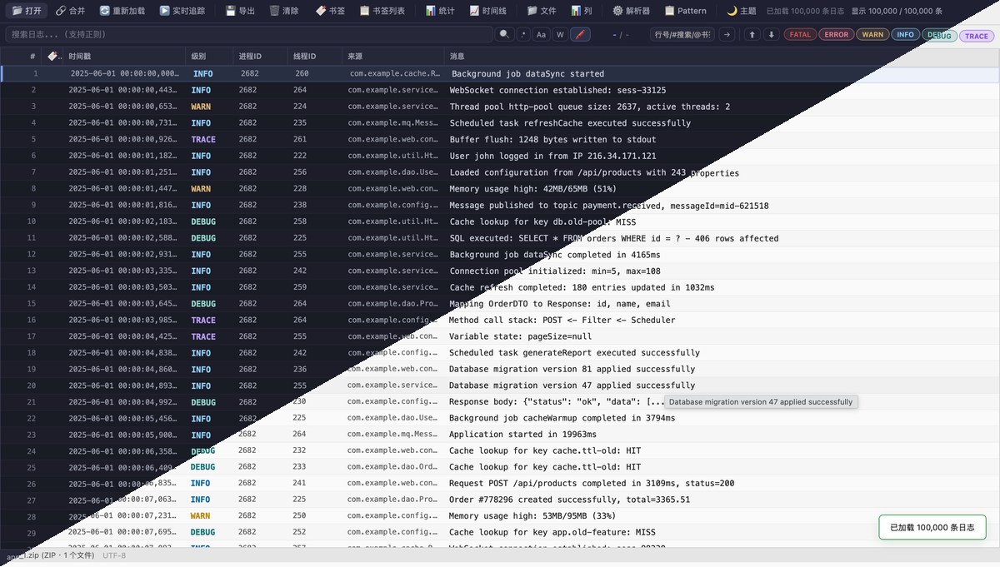

<p align="center">
  <h1 align="center">Web Log Viewer</h1>
  <p align="center">浏览器端日志查看与分析工具</p>
  <p align="center">
    <b>纯前端 · 零依赖 · 无需后端</b><b>-</b><b>Coding by Agent</b>
  </p>
  <p align="center">
    <a href="#核心功能">功能特性</a> ·
    <a href="#快速开始">快速开始</a> ·
    <a href="#使用场景">使用场景</a> ·
    <a href="doc/development.md">开发文档</a> ·
    <a href="doc/install.md">安装指南</a>
  </p>
</p>

<p align="center">
  
  
  
  
  
  
  
  
</p>

Web Log Viewer 是一个纯浏览器端运行的日志查看与分析工具。所有解析、搜索、过滤操作均在浏览器本地完成，**数据不会离开你的设备**。

## 预览



## 核心功能

- **📂 多格式文件支持** — 直接打开 `.log`、`.txt`，自动解压 `.zip`、`.tar.gz`、`.tgz`、`.tar`、`.gz`
- **🔍 智能日志解析** — 内置 Bracket Log、Log4j、Syslog、Apache/Nginx、JSON 等 6 种预设，支持自动检测
- **🧠 智能规则生成器** — 自动对日志行分词，所见即所得分配字段
- **📊 高性能虚拟滚动表格** — 百万级日志行流畅渲染
- **🔎 全文搜索与过滤** — 实时搜索、正则匹配、级别过滤、高级条件过滤
- **📈 统计与时间线** — 级别分布、时间概览、Canvas 散点图时间线
- **🔖 书签系统** — 标记重要条目，快速跳转
- **⚙️ 自定义 Pattern** — 保存解析规则到 IndexedDB，跨会话复用
- **🌙 暗色/亮色双主题** — 保护视力，适应不同环境

## 快速开始

```bash
# 1. 克隆仓库
git clone https://github.com/yourusername/web_log_viewer.git
cd web_log_viewer

# 2. 启动 HTTP 服务器
python3 server.py

# 3. 浏览器访问
open http://localhost:8765
```

也可以直接双击 `index.html` 打开，或使用其他静态服务器。

> 详细安装方式请参阅 [安装指南](doc/install.md)。

## 使用场景

| 场景 | 说明 |
|------|------|
| **开发调试** | 快速分析应用日志，搜索异常栈和错误信息 |
| **运维排障** | 查看服务器日志，时间线可视化定位故障时间点 |
| **审计分析** | 合并多个日志文件，统计错误分布和频率 |
| **离线查看** | 下载 `.zip` 压缩的日志，离线分析不泄露数据 |

更多使用示例 → [使用实例](doc/usage-examples.md)

## 浏览器兼容

| 浏览器 | 最低版本 | 说明 |
|--------|---------|------|
| Chrome | 90+ | 完全支持 |
| Firefox | 90+ | 完全支持 |
| Edge | 90+ | 完全支持 |
| Safari | 15+ | 基本支持 |

需要浏览器支持 ES2020、IndexedDB 和 `TextDecoder` API。

## 项目文档

| 文档 | 说明 |
|------|------|
| [功能介绍](doc/features.md) | 完整功能清单和键盘快捷键 |
| [安装指南](doc/install.md) | 多种启动方式、常见问题 |
| [使用实例](doc/usage-examples.md) | 8 种典型使用场景详细步骤 |
| [开发指南](doc/development.md) | 模块架构、开发调试、代码规范 |

## 许可证

[MIT License](LICENSE) — 详见 [LICENSE](LICENSE) 文件。
